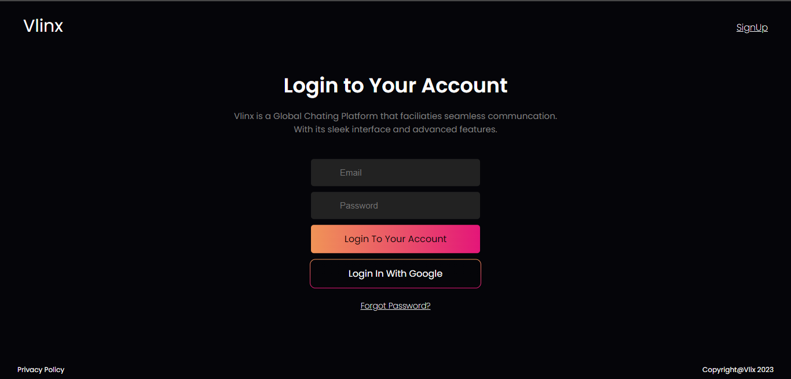
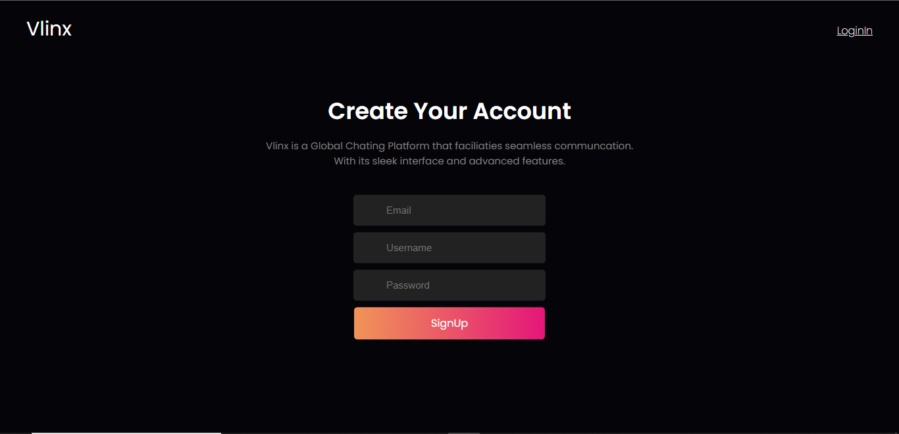
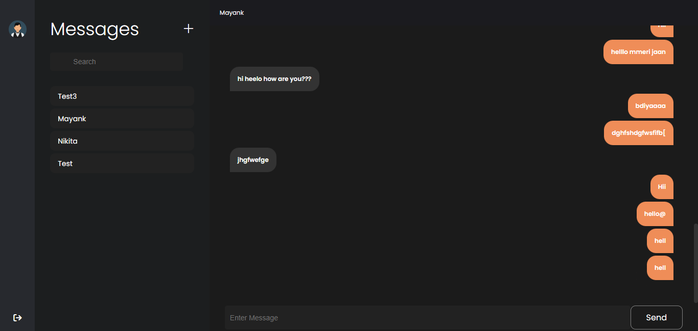

# React-Firebase Chat App








A realtime messaging web application built with ReactJS and Firebase. Connect with your friends and colleagues with this simple, yet powerful chat platform.

## Tech Stack

- **Frontend**:
  - [ReactJS](https://reactjs.org/)
  - HTML
  - CSS
  - JavaScript
- **Backend**:
  - [Firebase](https://firebase.google.com/)

## Features

- Realtime messaging.
- User authentication.
- Sleek UI for easy chatting.
- Responsive design. (Working on It.)

## Getting Started

### Prerequisites

- Node.js and npm installed on your machine.
- Firebase project.

### Setup

1. Clone the repository:

```bash
git clone https://github.com/git-SwitchBlade/react-firebase-chatapp.git
cd react-firebase-chatapp
```

2. Install Dependencies

```bash
npm install
```
3. Insert Firebase API KEY into './src/firebase.js'

4. Start the Development Server

```bash
npm start
```

The application will open in your default browser at http://localhost:3000.

### Contributing

Pull requests are welcome! For major changes, please open an issue first to discuss what you would like to change.

